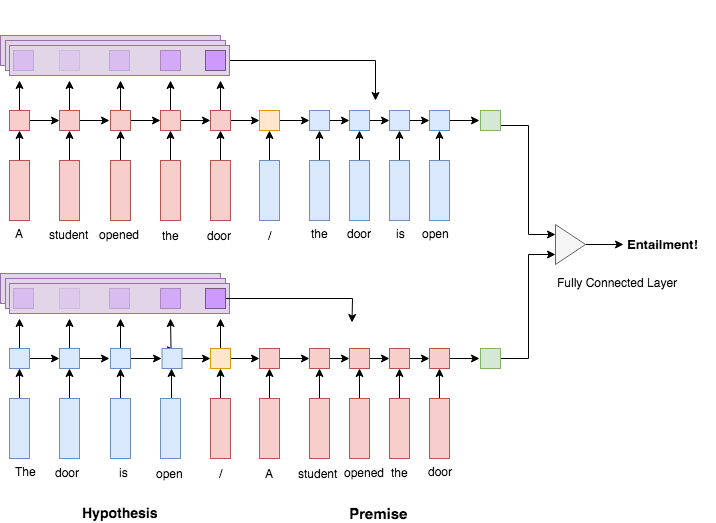

# neural-attention
Tensorflow implementation of [Reasoning about Entailment with Neural Attention](https://arxiv.org/abs/1509.06664)


## Objective
Implement neural attention models to solve entailment classification suggested by Rocktäschel.

We also test our model with [Quora dataset](https://data.quora.com/First-Quora-Dataset-Release-Question-Pairs) for the duplicate question detection.

## Dataset
[The Stanford Natural Language Inference (SNLI) Corpus](https://nlp.stanford.edu/projects/snli/) contains 3 datasets `snli_1.0_train.txt`, `snli_1.0_dev.txt`, `snli_1.0_test.txt`

```python
# contradiction: A contradicts B
A = "A person on a horse jumps over a broken down airplane."
B = "A person is at a diner, ordering an omelette."

# entailment: A implies B
A = "A person on a horse jumps over a broken down airplane."
B = "A person is outdoors, on a horse."

# neutral: A neither proves nor disproves B
A = "A person on a horse jumps over a broken down airplane."
B = "A person is training his horse for a competition."
```

The [Quora dataset](https://data.quora.com/First-Quora-Dataset-Release-Question-Pairs)
contains question-pairs and corresponding binary labels (duplicates or not)
```python
# duplicate questions
q1 = "How do I raise funds for a startup business idea?"
q2 = "How can I get funds for my business idea?"

# non-duplicate questions
q1 = "What is the molecular mass of caffeine?
q2 = "What is molecular mass?"
```

## Results
Currently training ...

## Training Yourself
In order to train our model, download pre-trained [Glove](https://nlp.stanford.edu/projects/glove/) and [SNLI](https://nlp.stanford.edu/projects/snli/). You can run bash script to download them.
```
sh setup.sh
```
To train our model, simply run
```
python train.py
```

## Model Architecture
Our baseline model is proposed by the original [paper](https://nlp.stanford.edu/pubs/snli_paper.pdf). The first Recurrent Neural Network (**encoder**) reads premise and creates a summary of them. Then the second Recurrent Neural Network (**decoder**) received the last hidden state of premise and reads hypothesis. We use the last hidden state from the second RNN as context vectors of both premise and hypothesis. Finally we perform classification with a multilayer neural net.


New model proposed by Rocktäschel contains so-called an attention layer. As a decoder reads hypothesis, an attention layer will calculate weighted vectors of premise and feeds them into the hidden layers of the decoder. This way, the decoder has a full-access to the premise regardless of the location.


#### Inputs
For both datasets, our model takes 2 texts (premise and hypothesis) and lengths for each texts. Feeding text lengths allows us to use `tf.nn.dynamic_rnn`, which supports variable length inputs. The input texts are integer-encoded such that the integer corresponds with the look up key for the word embedding model. MAX_LENGTH is length of the longest input. The actual length of inputs will be fed through 'input_length' tensor.

```python
# integer-encoded input premise
self.premise_inputs = tf.placeholder(tf.int32, [BATCH, MAX_LENGTH], name = 'premise_input')
# actual non-padded length of each input passages; used for dynamic unrolling
self.p_input_lengths = tf.placeholder(tf.int32, [BATCH], name = 'input_length')
```

Our second input needs to be prepended by a start token.
```python
# concatenate the starting token
start_tokens = tf.constant(0, shape=[BATCH], dtype=tf.int32)
self.hypothesis_inputs = tf.placeholder(tf.int32, [BATCH, MAX_LENGTH], name = 'hypothesis_input')
hypothesis_inputs = tf.concat([tf.expand_dims(start_tokens, 1), self.hypothesis_inputs], 1)

# update the sequence length to account for the additional token
extra_length = tf.constant(1, shape=[BATCH], dtype=tf.int32)
self.h_input_lengths = tf.placeholder(tf.int32, [BATCH], name = 'input_length')
h_input_lengths = tf.add(self.h_input_lengths, extra_length)
```

#### Embedding
2 inputs will be converted by pre-trained word embedding matrix using `tf.nn.embedding_lookup`. We used 50 dimensional Glove embedding.

```python
# load pre-trained matrix
word_matrix = tf.constant(np.load('./data/word_matrix.npy'), dtype=tf.float32)
self.word_matrix = tf.Variable(word_matrix, trainable=False, name='word_matrix')
# embedding for the premise
self.premise_encode = tf.nn.embedding_lookup(self.word_matrix, self.premise_inputs, name='p_encoded')
# embedding for the hypothesis
self.hypothesis_encode = tf.nn.embedding_lookup(self.word_matrix, hypothesis_inputs, name='h_encoded')
```

#### Conditional Encoding

Conditional Encoding is done by 2 RNNs, **encoder** and **decoder**. **Encoder** is a standard RNN, generating representation of inputs. **Decoder** will read the second inpu, starting from the final hidden state that the **encoder** generates.

##### Encoder
```python
# standard RNN syntax
RNN_CELL = tf.contrib.rnn.LSTMCell
if LAYER > 1:
  p_cell = MultiRNNCell([DROP_CELL(RNN_CELL(NUM_UNIT), output_keep_prob=1.0-DROP_OUT) for _ in range(LAYER)])
else:
    p_cell = RNN_CELL(NUM_UNIT)
    p_cell = DROP_CELL(p_cell, output_keep_prob=1.0-DROP_OUT)

init_state = p_cell.zero_state(BATCH, dtype=tf.float32)
# output has the shape of BATCH x MAX_LENGTH x NUM_UNIT
self.p_embedding, self.p_state = tf.nn.dynamic_rnn(p_cell, self.premise_encode, sequence_length=self.p_input_lengths, initial_state=init_state)
```

##### Decoder
Decoder reads the second input but takes the last hidden state from the encoder as as initial state.
```python
# standard RNN syntax
RNN_CELL = tf.contrib.rnn.LSTMCell
if LAYER > 1:
  h_cell = MultiRNNCell([DROP_CELL(RNN_CELL(NUM_UNIT), output_keep_prob=1.0-DROP_OUT) for _ in range(LAYER)])
else:
    h_cell = RNN_CELL(NUM_UNIT)
    h_cell = DROP_CELL(h_cell, output_keep_prob=1.0-DROP_OUT)

# output has the shape of BATCH x MAX_LENGTH x NUM_UNIT
self.h_embedding, self.h_state = tf.nn.dynamic_rnn(h_cell, self.premise_encode, sequence_length=self.h_input_lengths, initial_state=self.p_state)
```

#### Alignment
First, we specify which attention mechanism to use. We used `tf.contrib.seq2seq.LuongAttention` since it has a fewer parameters to train. Then, we construct an RNN cell structure in a standard syntax. We complete the attention layer by passing the attention mechanism and the RNN cell to `tensorflow.contrib.seq2seq.AttentionWrapper`

```python
# example of attention encoder that reads premise
# attention mechanisms over premise
attention = tf.contrib.seq2seq.LuongAttention(NUM_UNIT, self.p_embedding,
    memory_sequence_length=self.p_input_lengths, dtype=tf.float32)
# create RNN cell for the encoder
if LAYER > 1:
    a_cell = MultiRNNCell([DROP_CELL(tf.contrib.rnn.GRUCell(NUM_UNIT), output_keep_prob=1.0-DROP_OUT) for _ in range(LAYER)])
else:
    a_cell = tf.contrib.rnn.GRUCell(NUM_UNIT)
    a_cell = DROP_CELL(a_cell, output_keep_prob=1.0-DROP_OUT)
# attend over preise
attention_cell = AttentionWrapper(a_cell, attention, alignment_history=True)
```

A decoder receives the attention results and dynamically updates hidden layers. We pass inputs to the decoder by using `tf.contrib.seq2seq.TrainingHelper`. When we don't have an access to inputs such as neural translation during test time, you need to use a different helper such as `tf.contrib.seq2seq.GreedyEmbeddingHelper`.

Finally construct a decoder by using `tf.contrib.seq2seq.BasicDecoder` and `tf.contrib.seq2seq.dynamic_decode`.

```python
# specify inputs to the decoder, in our case, hypothesis
helper = tf.contrib.seq2seq.TrainingHelper(inputs=self.hypothesis_encode, sequence_length=self.h_input_lengths)
# define initial state using attention_cell from encoder
attention_state = attention_cell.zero_state(BATCH, dtype=tf.float32)
# create a decoder with encoder from the previous section, helper, and initial state
decoder = tf.contrib.seq2seq.BasicDecoder(attention_cell, helper, attention_state)
# output of the decoder is a new representation of hypothesis with an attention over premise
self.aligned, self.aligned_state, _ = tf.contrib.seq2seq.dynamic_decode(decoder, maximum_iterations=MAX_LENGTH)
```

`self.aligned_state` is an input to fully connected layer followed by soft max, which
performs predictions.

You can also visualize the heatmap of attentions by stacking the alignment history
```python
# self.heatmap is a tensor with an shape [BATCH x MEMORY x INPUT]
# MEMORY x INPUT represents the heatmap of input over memory
self.heatmap = tf.transpose(self.aligned_state.alignment_history.stack(), [1,0,2])
```

### Bidirectional Architecture
Though prone to overfit, we also support bidirectional model by setting the parameter `BI_DIRECTIONAL` to `True`


