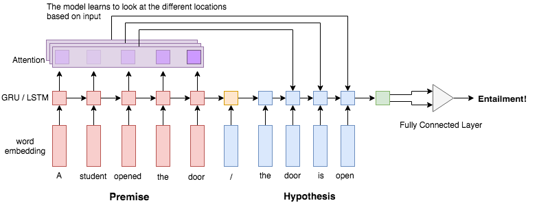
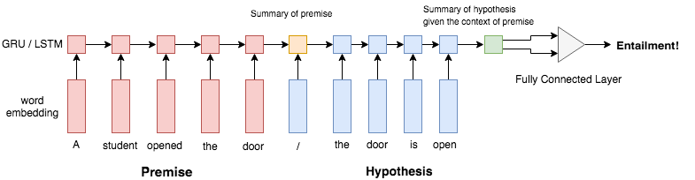

# neural-attention
Tensorflow implementation of [Reasoning about Entailment with Neural Attention](https://arxiv.org/abs/1509.06664)



## Objective
Implement neural attention models to solve entailment classification suggested by Rocktäschel.
We also test our model with [Quora dataset](https://data.quora.com/First-Quora-Dataset-Release-Question-Pairs)
for the duplicate question detection.

## Dataset
[The Stanford Natural Language Inference (SNLI) Corpus](https://nlp.stanford.edu/projects/snli/)
contains 3 datasets `snli_1.0_train.txt`, `snli_1.0_dev.txt`, `snli_1.0_test.txt`

```python
# contradiction: A contradicts B
A = "A person on a horse jumps over a broken down airplane."
B = "A person is at a diner, ordering an omelette."

# entailment: A implies B
A = "A person on a horse jumps over a broken down airplane."
B = "A person is outdoors, on a horse."

# neutral: A neither proves nor disproves B
A = "A person on a horse jumps over a broken down airplane."
B = "A person is training his horse for a competition."
```

The [Quora dataset](https://data.quora.com/First-Quora-Dataset-Release-Question-Pairs)
contains question-pairs and corresponding binary labels (duplicates or not)
```python
# duplicate questions
q1 = "How do I raise funds for a startup business idea?"
q2 = "How can I get funds for my business idea?"

# non-duplicate questions
q1 = "What is the molecular mass of caffeine?
q2 = "What is molecular mass?"
```
## Results

## Training Yourself
In order to train our model, download pre-trained [Glove](https://nlp.stanford.edu/projects/glove/)
and [SNLI](https://nlp.stanford.edu/projects/snli/). You can run bash script to download them.
```
sh setup.sh
```
To train our model, simply run
```
python train.py
```

## Model Architecture
Our baseline model is proposed by the original [paper](https://nlp.stanford.edu/pubs/snli_paper.pdf)
of SNLI dataset. The first Recurrent Neural Network (**encoder**) reads premise and
creates a summary of them. Then the second Recurrent Neural Network (**decoder**) received the
last hidden state of premise and reads hypothesis. We use the output from the second
RNN as context vector of both premise and hypothesis, and perform classification
with multilayer neural net.



New model proposed by Rocktäschel contains so-called attention layer.
As the decoder reads hypothesis, the attention layer will calculate the weighted
vector of premise and feeds it into the hidden layer of decoder. This way, decoder has
a full-access to the premise regardless of the location.


#### Inputs
For both dataset, the model takes 5 inputs, 2 texts and lengths of each texts. Feeding text lengths allows us to use `tf.nn.dynamic_rnn`, which supports variable length inputs.

#### Embedding

#### Encoder

#### Decoder

#### Classification

#### Loss
